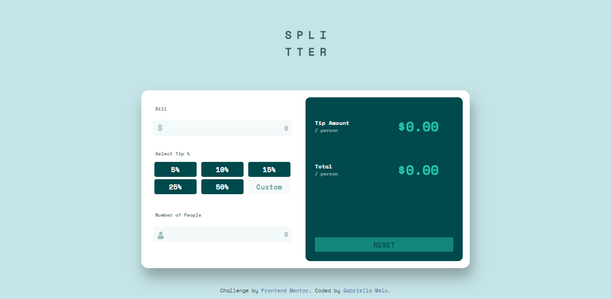

# Frontend Mentor - Tip calculator app

## Table of contents

- [Visão Geral](#visão-geral)
  - [O desafio](#o-desafio)
  - [Links](#links)
- [Meu Processo](#meu-processo)
  - [Construído com?](#construído-com?)
  - [O que eu aprendi?](#o-que-eu-aprendi?)
  - [O que preciso focar mais?](#o-que-preciso-focar-mais?)
- [Autor](#autor)

## Visão Geral

## O desafio

O desafio se baseia na criação de uma calculadora, na qual os usuários poderão utilizar uma funcionalidade que, após a inserção do valor da conta, número de pessoas a dividindo e taxa da gorjeta, realiza o cálculo do valor da gorjeta e total da conta por pessoa. 

Os usuários devem ser capazes de:

- Calcular a gorjeta correta e o custo total da conta por pessoa;
- Visualizar o layout otimizado para a interface dependendo do tamanho da tela do dispositivo utilizado; 
- Ver os estados de foco para todos os elementos interativos da página.

### Links

- Solução URL: https://www.frontendmentor.io/solutions/responsive-tip-calculator-puxbRN0CPl

- Live Site URL: https://gabriellaam.github.io/TipCalculator/

## Meu Processo

### Construído com?

 

&nbsp;

&nbsp;

&nbsp;

### O que eu aprendi?

Notei que após o último desafio, meus conhecimentos em relação à CSS Grid e Flexbox evoluíram, pude completar a parte visual do site em apenas um dia. Aproveitei a oportunidade para colocar em prática um conceito que comecei a estudar recentemente: Sass. Mesmo sendo minha primeira vez o utilizando, facilitou muito o processo de construção do design, assim pude entender melhor como ele é estruturado e como posso trabalhar de maneira mais rápida o colocando em prática.

Ainda, foi possível evoluir minhas habilidades em relação a responsividade, entendi melhor as unidades de medida "rem" e "em", apesar de não as ter utilizado muito, estudei sobre elas durante o desenvolvimento do projeto, pois percebi que poderiam facilitar a construção de alguns elementos. Por fim, pratiquei JavaScript e notei uma melhora extremamente significativa no entendimento de sua lógica, além de compreender melhor alguns conceitos em relação a eventos e manipulação do DOM.

### O que preciso focar mais?

Pretendo continuar praticando os conceitos que aprendi sobre Sass e estudar mais a fundo o assunto, pois sei que ainda existem muitos tópicos que não compreendo muito bem. A utilização das unidades de medida "rem" e "em" também é algo que busco colocar em prática nos próximos projetos. Por fim, irei estudar e praticar mais JavaScript, pois ainda possuo dificuldades lidando com a sua lógica.

## Autor

 

&nbsp;

&nbsp;

